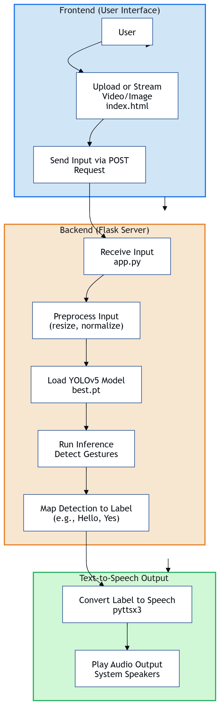

# 🤟 Sign Language Detection Web App

A real-time sign language detection web application using YOLOv5, Flask, and JavaScript — deployed on Hugging Face Spaces.

## 🌟 Features

- Real-time gesture detection via webcam 📷
- Trained YOLOv5 model with 6 ASL gestures:
  - Hello
  - I Love You
  - No
  - Please
  - Thanks
  - Yes
- Text-to-speech output using JavaScript 🗣️
- Clean, responsive frontend with HTML/CSS/JS
- Easy to access from any device 🌐
- Deployed on Hugging Face Spaces 🚀

---

## 🔧 Tech Stack

- **Frontend:** HTML, CSS, JavaScript
- **Backend:** Python (Flask)
- **Model:** YOLOv5 (`best.pt`)
- **Deployment:** Hugging Face Spaces

---
## 🧠 Model Architecture

# 🧠 Sign Language Detection with YOLOv5

A real-time American Sign Language (ASL) recognition web app powered by YOLOv5, webcam integration, and speech synthesis — making communication more accessible and interactive! 🤟✨

---

## 🧠 Model Info

Trained on a **custom dataset** featuring **6 American Sign Language gestures**, this model uses **YOLOv5** for fast and accurate gesture detection.  
🔁 Processes input **frame-by-frame** directly from the webcam.

---

## 🔊 Speech Synthesis

The app converts detected sign language gestures into **spoken words** using the browser's **SpeechSynthesis API** 🗣️  
This creates a **smooth, hands-free, and voice-assisted** experience — great for accessibility and real-world communication.

---

## 🙌 Acknowledgements

- [YOLOv5](https://github.com/ultralytics/yolov5) by **Ultralytics**
- [Hugging Face Spaces](https://huggingface.co/spaces) for deployment
- [JavaScript Web Speech API](https://developer.mozilla.org/en-US/docs/Web/API/Web_Speech_API) for speech synthesis

---

## 📬 Contact

Have questions, ideas, or feedback?  
Feel free to reach out — we’d love to hear from you!
- 📧 Email: [shubhamsubodhtiwari@gmail.com]
- 💼 LinkedIn: [Shubham Tiwari]
---
